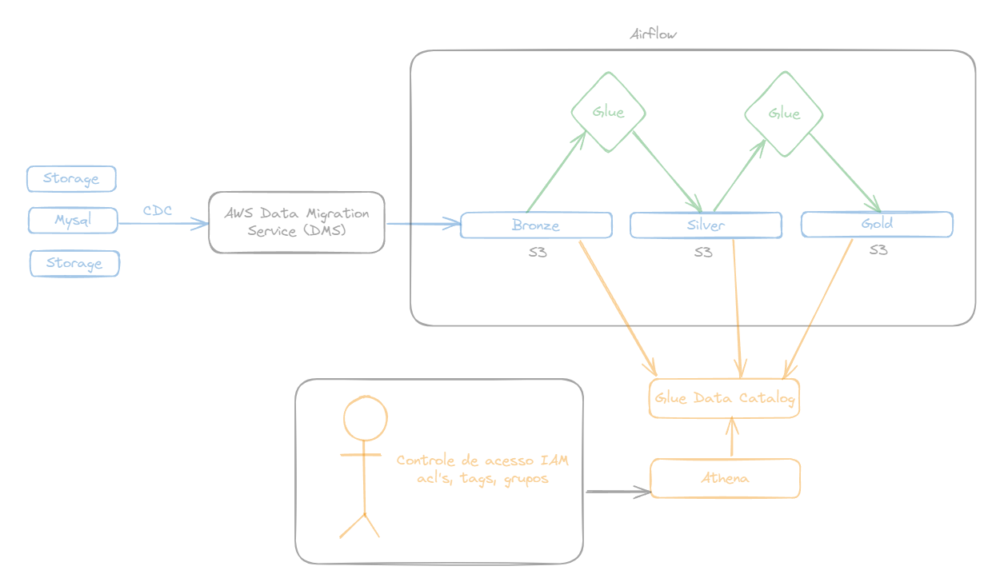

# 🛠️ Projeto de Engenharia de Dados 

Este projeto implementa um pipeline completo de Engenharia de Dados utilizando PySpark e serviços AWS. A arquitetura segue o modelo de **camadas (bronze, silver e gold)**, utilizando uma **Landing Zone**.

---

## Visão Geral

- **Origem dos dados:** CSV iniciamente local em /datasets/clientes_sinteticos.csv que popula o S3 etlproj-landing-zone/arquivo/ via terraform
- **Destino:** Data Lake em Amazon S3
- **Transformação:** PySpark com AWS Glue
- **Armazenamento:** Arquitetura em camadas (lading-zone → bronze → silver → gold)
- **Catálogo de dados:** Crawlers + AWS Glue Data Catalog
- **Consultas:** AWS Athena

---

## Etapas do Projeto

### 1. `1.ETL/script.py`
- **Objetivo:** realizar o pipeline de extração, transformação e carga.
- Leitura do arquivo `clientes_sinteticos.csv` da Landing Zone (S3).
- Escrita na camada **bronze** com tratamento para deixar o nome dos clientes com letra maiuscula e renomear a coluna de telefone do cliente.
- Deduplicação para a camada **silver** tratativa na coluna de telefone para padrão (NN)NNNNN-NNNN.
- Escrita em Parquet particionado por `anomesdia` com acesso via Glue Catalog

---

### 2. `2.AnaliseDados/analise.py`
- **Objetivo:** executar análises sobre o conjunto tratado.
- Top 5 clientes com mais atualizações
- Média de idade dos clientes ativos

---

### 3. `3.DesenhodeArquitetura/`
- **Objetivo:** apresentar visualmente a arquitetura da solução a seguir:

Proponha uma arquitetura na AWS para coletar dados de cadastros de clientes em um banco MySQL. Esses dados devem ser persistidos em um datalake que usa a arquitetura medalhão:

Desenhe um sistema para coletar dados do banco MySQL realizando CDC.
O processamento e escrita deve ser projetado para os 3 niveis do lake (bronze, silver e gold)
Além do armazenamento do dado será necessaria uma governança de acesso a nível de usuário
 



---

### 4. `4.DataQuality/script_data_quality.py`
- **Objetivo:** validar as dimensões de qualidade dos dados na camada Silver
- Validações aplicadas:
  - Completude: Verifica se campos obrigatórios estão nulos
  - Unicidade: Verifica cod_cliente duplicado
  - Acurácia: Validação de formato de telefone
  - Consistência: Validação de valores negativos em vl_renda
  - Validade: Nomes inválidos + datas futuras

---

### 5. `5.TesteUnitario/`
- **Objetivo:** validar funções críticas da transformação
- Testes com `unittest` para função, validação de telefone
- Casos cobertos:
  - Happy Path
  - Casos extremos (valores nulos, espaços, repetições)
  - Casos inválidos

---

### 6. `6.InfraAsCode/`
-  **Objetivo:** provisionar infraestrutura na AWS via Terraform
- Criação de buckets (landing-zone, bronze, silver, scripts)
- Criação de Glue Job, Glue Crawlers
- Políticas de IAM
- Arquivos:
  - `glue.tf`: job, crawler, banco de dados Glue
  - `storage.tf`: buckets, ACLs e criptografia
  - `iam.tf`: roles, policies e acessos

---

## 💻 Execução 

### Etapas

```bash
# 1. Ative o ambiente
python -m venv venv
venv\Scripts\activate

# 2. Instale os pacotes
pip install -r requirements.txt

# 3. Execute o terraform
cd terraform
terraform init
terraform plan
terraform apply

# 4. Execução
 1. ETL/script.py (Terraform - AWS Glue Job)
 2. AnaliseDados/analise.py (Terraform - AWS Glue Job Notebook)
 3. DataQuality/script_data_quality.py (Terraform - AWS Glue Job)
 4. python 5.TesteUnitario/unit_test.py (local)
